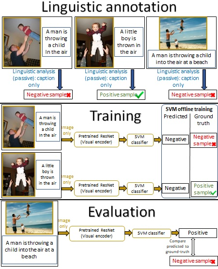

# A Large-Scale Multilingual Study of Visual Constraints on Linguistic Selection of Descriptions

## Overview

<!---This is the codebase of the paper [A Large-Scale Multilingual Study of Visual Constraints on Linguistic Selection of Descriptions](https://uriberger.github.io/).--->
We present a large, multilingual study into how vision constrains linguistic choice. We train classifiers to predict the probability of expressing a property from
raw images. We complement this investigation with a corpus study.

## Visualization of the Classifier Model

## Installation

1. Install requirements from requirements.txt file.
2. git clone the Recognizers-Text github package (https://github.com/microsoft/Recognizers-Text.git) under the project root and follow the python installation steps in https://github.com/Microsoft/Recognizers-Text/tree/master/Python. Then, open the number_recognizer file (Recognizers-Text\Python\libraries\recognizers-number\recognizers_number\number\number_recognizer.py), go to the NumberRecognizer class, initialize_configuration function and search for the "# region German" mark. If this region is commented, uncomment it.
3. Download the MoCo pre-trained models from the following link: https://dl.fbaipublicfiles.com/moco/moco_checkpoints/moco_v2_800ep/moco_v2_800ep_pretrain.pth.tar, create a directory named 'models' under the project root and place the MoCo model in it.
4. Download relevant datasets and add the flag "--datasets_dir \<path to datasets dir\>" when executing main.py.

## Execution
- To train models use the main.py file (run with --help to see all options)
- To run corpus analysis experiments use the data_analysis.py file
